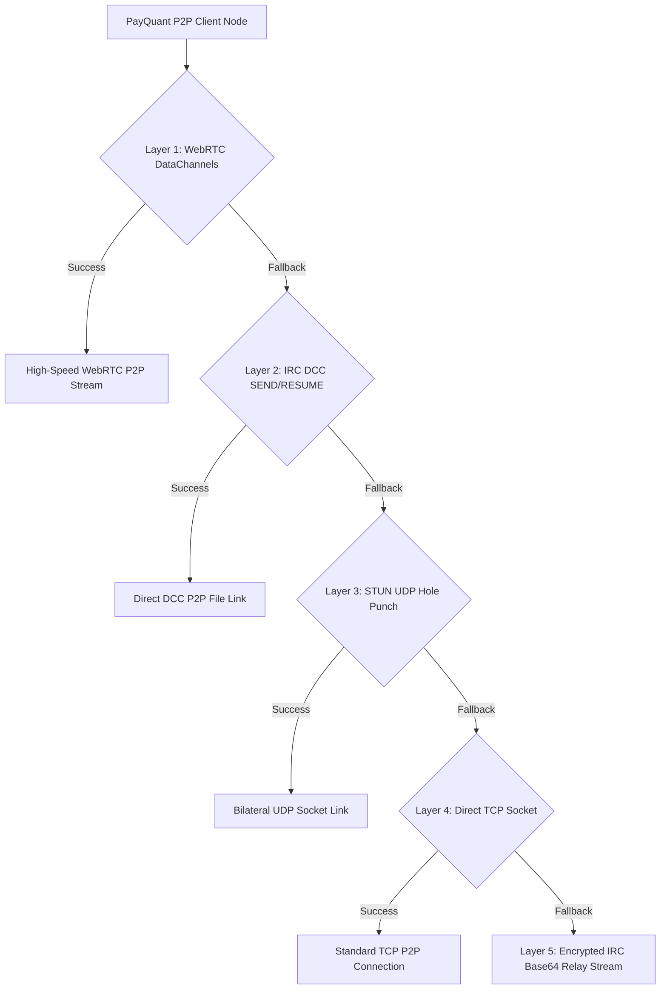

# 🚀 PayQuant (PQN) – Quantum-Resistant AI Blockchain Platform (v6.4.0 Master Release)

<p align="center">
  
</p>

<p align="center">
  <b>The World's First Post-Quantum Self-Optimizing Blockchain Ecosystem</b><br>
  <i>Powered by NIST FIPS 204 ML-DSA-65 Signatures, Zero-Port-Forwarding P2P Streaming, and Enterprise RocksDB Storage</i>
</p>

<p align="center">
  <a href="https://github.com/timfromhcs/payquant/actions/workflows/build-all-platforms.yml"></a>
  <a href="https://github.com/timfromhcs/payquant"></a>
  <a href="https://github.com/timfromhcs/payquant/releases"></a>
  <a href="https://timfromhcs.github.io/payquant/"></a>
  <a href="LICENSE"></a>
</p>

---

## 🌟 Executive Overview

**PayQuant (PQN) v6.4.0** is the ultimate release featuring native **Platform Setup Installers** for Windows, Linux, macOS, and Android. It introduces:
- **Payout Wallet Address Entry**: Configure your PQN wallet payout address before mining. Mined block rewards (50 PQN) are automatically credited and broadcasted across the network.
- **Background Daemon Loops**: Non-blocking Node and Miner daemon threads for real-time job distribution (`get_mining_job` & `submit_block`), peer requests, and WebRTC status reporting.
- **WebRTC & IRC-DCC Zero-Port P2P Streaming**: 5-layer NAT traversal cascade.
- **Enterprise RocksDB Engine**: RocksDB Column Families with automatic database repair.
- **Quantum Backup**: 24-word BIP-39 seedphrases with ML-DSA-65 Dilithium signature validation.

---

## 📦 Multi-Platform Setup Installers (v6.4.0)

| Platform | Installer Package | Suite / Application | Download Link |
|----------|-------------------|---------------------|---------------|
| **Windows x64** | `PayQuant-Node-Miner-Suite-Setup-v6.3.0.exe` | Combined Full Node + Solo Miner Setup | [Releases v6.4.0](https://github.com/timfromhcs/payquant/releases) |
| **Windows x64** | `PayQuant-Wallet-Setup-v6.3.0.exe` | Standalone Light Wallet Setup | [Releases v6.4.0](https://github.com/timfromhcs/payquant/releases) |
| **Windows x64** | `PayQuant-Explorer-Setup-v6.3.0.exe` | Standalone Public Explorer Setup | [Releases v6.4.0](https://github.com/timfromhcs/payquant/releases) |
| **Linux x64** | `PayQuant-Node-Miner-Linux.AppImage` | Portable Linux Desktop Suite | [Releases v6.4.0](https://github.com/timfromhcs/payquant/releases) |
| **macOS Universal** | `PayQuant-Ecosystem-macOS.dmg` | macOS App Installer Package | [Releases v6.4.0](https://github.com/timfromhcs/payquant/releases) |
| **Android Mobile** | `PayQuant-Wallet-arm64-v8a.apk` | Native Light Wallet Mobile APK | [Releases v6.4.0](https://github.com/timfromhcs/payquant/releases) |

---

## 🏛️ Ecosystem Architecture



---

## ⚡ Quick Start

### 1. Build Executables & Run Local Diagnostics
```bash
# Execute Win32 Ecosystem Test Suite (7 Categories)
python scripts/local_test_suite.py

# Build Native Desktop Installers & PyInstaller Binaries
python contrib/build_local_executables.py
```

### 2. Launch Unified Desktop Suite
```bash
# Launch Combined Full Node & Solo Miner Desktop App
python contrib/node_miner_gui.py
```

---

## 📄 License

Distributed under the MIT License. See [`LICENSE`](LICENSE) for more details.
