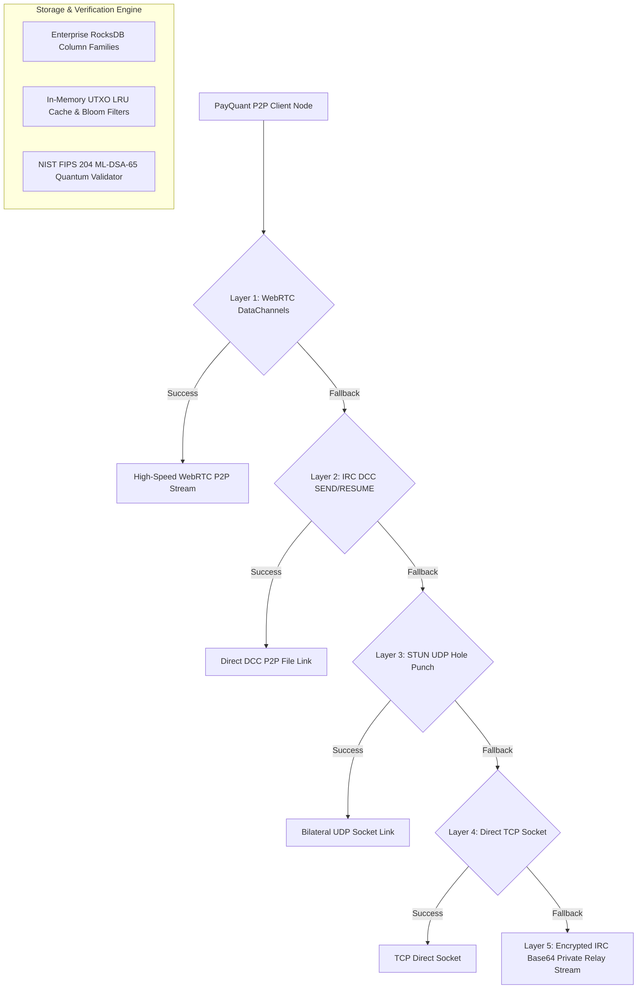

# 🚀 PayQuant (PQN) – Quantum-Resistant AI Blockchain Platform (v6.3.0 Setup Installer Release)

<p align="center">
  
</p>

<p align="center">
  <b>The World's First Post-Quantum Self-Optimizing Blockchain Ecosystem</b><br>
  <i>Powered by NIST FIPS 204 ML-DSA-65 Signatures, Zero-Port-Forwarding P2P Streaming, and Enterprise RocksDB Storage</i>
</p>

<p align="center">
  <a href="https://github.com/timfromhcs/payquant/actions/workflows/build-all-platforms.yml"></a>
  <a href="https://github.com/timfromhcs/payquant"></a>
  <a href="https://github.com/timfromhcs/payquant/releases"></a>
  <a href="https://timfromhcs.github.io/payquant/"></a>
  <a href="LICENSE"></a>
</p>

---

## 🌟 Executive Overview

**PayQuant (PQN) v6.3.0** is the ultimate release featuring native **Platform Setup Installers** for Windows, Linux, macOS, and Android. It introduces a **Combined Node + Miner Suite**, **WebRTC & IRC-DCC Zero-Port P2P Streaming**, **Enterprise RocksDB Column Families**, and **24-word BIP-39 Quantum Backup Seedphrases**.

---

## 📦 Multi-Platform Setup Installers (v6.3.0)

| Platform | Installer Package | Suite / Application | Download Link |
|----------|-------------------|---------------------|---------------|
| **Windows x64** | `PayQuant-Node-Miner-Setup-v6.3.0.exe` | Combined Full Node + Solo Miner Setup | [Releases v6.3.0](https://github.com/timfromhcs/payquant/releases) |
| **Windows x64** | `PayQuant-Wallet-Setup-v6.3.0.exe` | Standalone Light Wallet Setup | [Releases v6.3.0](https://github.com/timfromhcs/payquant/releases) |
| **Windows x64** | `PayQuant-Explorer-Setup-v6.3.0.exe` | Standalone Public Explorer Setup | [Releases v6.3.0](https://github.com/timfromhcs/payquant/releases) |
| **Linux x64** | `PayQuant-Node-Miner-Linux.AppImage` | Portable Linux Desktop Suite | [Releases v6.3.0](https://github.com/timfromhcs/payquant/releases) |
| **macOS Universal** | `PayQuant-Ecosystem-macOS.dmg` | macOS App Installer Package | [Releases v6.3.0](https://github.com/timfromhcs/payquant/releases) |
| **Android Mobile** | `PayQuant-Wallet-arm64-v8a.apk` | Native Light Wallet Mobile APK | [Releases v6.3.0](https://github.com/timfromhcs/payquant/releases) |

---

## 🏛️ Ecosystem Architecture



---

## ⚡ Key Architectural Upgrades

### 1. 🌐 Zero-Port Router Forwarding P2P Cascade
Nodes establish direct stream links behind home routers, firewalls, and CGNAT without manual port forwarding:
- **WebRTC DataChannels & ICE**: Direct browser & native socket streams over public STUN servers (`stun.l.google.com:19302`).
- **IRC DCC (Direct Client-to-Client)**: DCC SEND, DCC RESUME, and Reverse DCC P2P file transfers.
- **STUN UDP Hole Punching**: Bilateral NAT pinhole punching.
- **Encrypted IRC Base64 Relay Stream**: 100% guaranteed fallback relaying Base64 payload chunks over private IRC channels (`PRIVMSG`).

### 2. 💾 Enterprise RocksDB Storage & UTXO Fast-Sync
- **Column Families**: Separate tables for `blocks`, `utxo_set`, and `snapshots`.
- **In-Memory LRU Cache & Bloom Filters**: Sub-millisecond transaction verification and address balance lookups.
- **Fast-Sync UTXO Snapshots**: New nodes sync the full state in minutes rather than hours by pulling periodic verified UTXO snapshots over WebRTC or IRC DCC.

### 3. 💳 Quantum Light Wallet & Intent-Centric UX
- **NIST FIPS 204 ML-DSA-65 Signatures**: Immune to Shor's quantum algorithm.
- **24-Word BIP-39 Seedphrase**: 256-bit cryptographic entropy for 1-click recovery.
- **Intent-Centric Balance**: Large bold balances with **Tap-to-Hide** privacy (`👁️ Tap-to-Hide`).
- **Biometric Passkey Unlock**: Native WebAuthn API integration (TouchID, FaceID, Windows Hello).
- **Payment Invoices & Risk Simulator**: QR code payment generator and local quantum risk evaluator.

---

## 🚀 Quick Start (Zero-Install Dev Mode)

```bash
# Clone repository
git clone https://github.com/timfromhcs/payquant.git ~/payquant
cd ~/payquant

# Run local test suite
python scripts/local_test_suite.py

# Launch Combined Node & Miner Suite
python contrib/node_miner_gui.py

# Launch Standalone Light Wallet GUI
python contrib/wallet_gui.py

# Launch Standalone Public Explorer
python contrib/explorer_gui.py
```

### Windows 1-Click Launch & Test:
Double-click `run_all_tests.bat`.

---

## 📜 License

MIT License – see the [LICENSE](LICENSE) file for details.
