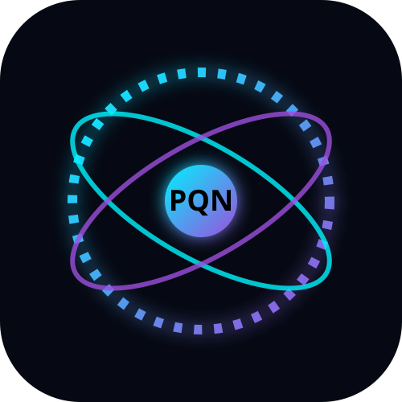
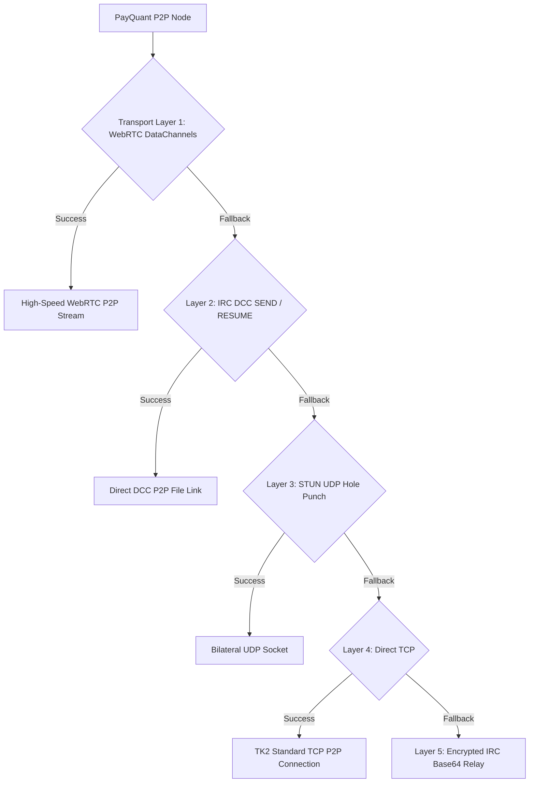

# 🚀 PayQuant (PQN) – Post-Quantum Self-Optimizing AI Blockchain

<p align="center">
  
</p>

<p align="center">
  <b>The World's First Post-Quantum, Self-Optimizing Blockchain Ecosystem</b><br>
  <i>NIST FIPS 204 ML-DSA-65 Signatures · Zero-Port-Forwarding P2P Streaming · Enterprise RocksDB · Merkle-Delta UTXO Sync · DirectDrop Encrypted Files</i>
</p>

<p align="center">
  <a href="https://github.com/timfromhcs/payquant/actions/workflows/build-all.yml"></a>
  <a href="https://github.com/timfromhcs/payquant"></a>
  <a href="https://github.com/timfromhcs/payquant/releases"></a>
  <a href="https://timfromhcs.github.io/payquant/"></a>
  <a href="LICENSE"></a>
</p>

<p align="center">
  <a href="https://timfromhcs.github.io/payquant/">🌐 Website</a> ·
  <a href="https://timfromhcs.github.io/payquant/download.html">⬇️ Download</a> ·
  <a href="https://timfromhcs.github.io/payquant/docs.html">📖 Docs</a> ·
  <a href="https://timfromhcs.github.io/payquant/architecture.html">🏗 Architecture</a> ·
  <a href="https://timfromhcs.github.io/payquant/security.html">🔐 Security</a>
</p>

---

## 🌟 What is PayQuant?

**PayQuant (PQN)** is a post-quantum, self-optimizing blockchain ecosystem designed to stay
private and functional no matter where it runs — from your home PC behind a router to a
cloud server. It combines:

| Pillar | What it gives you |
| --- | --- |
| 🛡️ **ML-DSA-65 (Dilithium)** | NIST FIPS 204 lattice signatures — quantum-attack resistant *today* |
| 🔀 **Zero-Port P2P** | 5-layer transport cascade (WebRTC → IRC DCC → STUN → TCP → encrypted relay). No port forwarding needed |
| 🗄️ **RocksDB Engine** | Column-family storage, UTXO LRU cache, Bloom filters, auto-repair on startup |
| 🧮 **Merkle-Delta Sync** | Canonical fingerprint compare → ships only UTXO deltas, not whole blobs |
| 📦 **DirectDrop Files** | AES-256-GCM sealed, love-code exchanged peer-to-peer file transfer |
| ⚡ **Fast-Sync** | Verified UTXO snapshots cut initial sync from hours to minutes |
| ⚡ **RinHash PoW** | ASIC-resistant memory-hard mining with 50 PQN block rewards |
| 💳 **Quantum Wallet** | 24-word BIP-39 seed encrypted with Argon2id master password |
| 🤖 **Self-Healing Daemons** | Background orchestration with health checks and ordered lifecycle |

---

## ✨ Features

- **Unified Node + Miner desktop suite** (`node_miner_gui.py`) and standalone GUIs for Node, Miner, Wallet and Explorer.
- **Payout wallet address persistence** – miners define a payout address before mining; settings are auto-loaded on every launch (`miner/backend/config_manager.py`).
- **Live WebSocket status & mining jobs** – `/ws/events` status stream, `get_mining_job` / `submit_block` over the signaling server.
- **Background daemon orchestration** – `backend/daemon.py` starts/status/stops node, miner, API and signaling as real processes, with `start_backend.bat/.sh` one-shot helpers.
- **Argon2id-encrypted wallet vault** – 24-word BIP-39 seeds, AES-256-GCM vault, seed-only recovery, auto-lock.
- **Built-in block explorer** – chain, address auditor and transaction viewer (desktop + light wallet).
- **Fast-sync UTXO snapshots** – verified snapshot generation & instant import via `contrib/fast_sync_engine.py`.
- **Merkle-delta UTXO sync** – `contrib/pqn_sync.py` compares canonical Merkle roots before transferring only changed UTXOs.
- **Super-Transport layer** – `contrib/pqn_netlib.py` unifies WebRTC/IRC-DCC/STUN/TCP/relay under one retryable ladder, optionally accelerated by libp2p/Noise.
- **DirectDrop peer-to-peer files** – 4-char transfer codes, AES-256-GCM sealed frames via `contrib/pqn_file.py`.
- **Cross-platform release pipeline** – `.github/workflows/build-all.yml` produces Windows `.exe`, Linux `.AppImage`, macOS `.dmg` and Android `.apk` on every release.

---

## 🏛️ Ecosystem Architecture



---

## ⚡ Quick Start

### From source

```bash
# 1. Clone
git clone https://github.com/timfromhcs/payquant.git
cd payquant

# 2. Run the 9-category ecosystem test suite
python scripts/local_test_suite.py

# 3. Launch the unified desktop suite (Full Node + Solo Miner)
python contrib/node_miner_gui.py
```

### Start the backend stack (node, miner, API, signaling)

```bash
# Linux / macOS
./scripts/start_backend.sh
# Windows
scripts\start_backend.bat

# Or manual control
python backend/daemon.py start all      # start node + miner + api + signaling
python backend/daemon.py status
python backend/daemon.py stop all
```

### Mining

```bash
python contrib/miner_gui.py                 # GUI solo miner (uses saved payout addr)
python backend/daemon.py start miner       # headless miner daemon
```

### API Server (REST + JSON-RPC)

The unified API server (`backend/api_server.py`) boots in any environment
(FastAPI/uvicorn when installed, pure-stdlib fallback otherwise) and exposes:

| Endpoint | Port | Purpose |
| --- | --- | --- |
| `GET /api/status` | `28377` | Real node height, balance, peers, hashrate, sync state |
| `GET /api/balance` | `28377` | Wallet balance |
| `GET /api/transactions` | `28377` | Wallet transaction history |
| `GET /api/mining/status` | `28377` | Live miner hashrate + active state |
| `GET /api/health` | `28377` | Liveness probe (daemon/scripts) |
| `WS /ws/events` | `28377` | Live status push stream |
| `POST /` (JSON-RPC) | `28332` | `getblockchaininfo`, `getbalance`, `listtransactions`, `gettransaction`, `getblockcount`, `getmininginfo` — consumed by the Electron light wallet |

```bash
python backend/api_server.py                # starts both :28377 (REST/WS) and :28332 (JSON-RPC)
```

---

## 🧪 Testing & Validation Gate

```bash
python scripts/local_test_suite.py          # 9 categories, MUST pass 100% clean
python contrib/build_local_executables.py   # rebuild local standalone binaries
cd wallet && npm run build:web              # wallet web/Android bundle
```

All commit/push-request PRs must pass the full suite.

---

## 📦 Releases

| Platform | Package |
|---|---|
| **Windows x64** | `PayQuant-Node-Miner-Suite-Setup.exe`, `PayQuant-Wallet-Setup.exe`, `PayQuant-Explorer-Setup.exe` |
| **Linux x64** | `PayQuant-Node-Miner-Linux.AppImage`, `payquantd` headless daemon |
| **macOS Universal** | `PayQuant-Ecosystem-macOS.dmg` |
| **Android** | `PayQuant-Wallet-arm64-v8a.apk` |

Every Tag `v*` triggers the full cross-platform build & release pipeline automatically.

---

## 📄 License

Distributed under the MIT License. See [`LICENSE`](LICENSE) for more details.