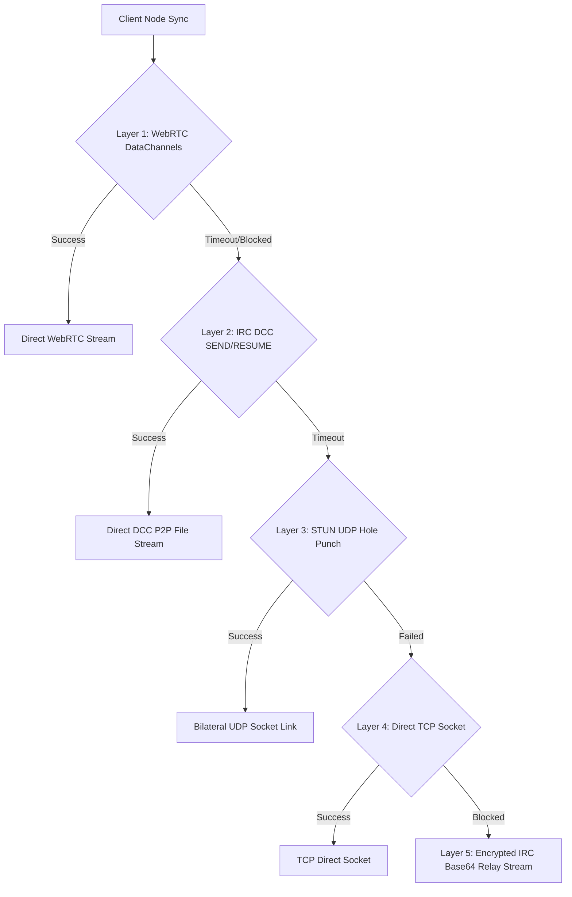

# 🏛️ PayQuant (PQN) Ecosystem Architecture Specifications

PayQuant (PQN) v2.0.0-quantum-genesis is built on a modular 3-tier architecture comprising **Post-Quantum Cryptography**, **Enterprise RocksDB Storage**, and **Zero-Port-Forwarding Hybrid P2P Networking**, anchored by a **TRNG-minted canonical mainnet genesis block**.

## 🧬 Chain Start (Mainnet Genesis)

| Chain-start constant | Value |
| --- | --- |
| **Genesis hash** | `c01d52bda35800c5d4f88d35f23529032fa8261938dfb300ea8b5c19218cc031` |
| **Merkle root** | `f48783d9e4a05e0a6856d2adac4415d12fcf73c42df72835c37aae537fb791c3` |
| **Timestamp** | `1786283877` (UTC) |
| **Backend** | `panta_sim` · 8-qubit · outcome `00000011` |
| **Coinbase** | `50.00000000 PQN` → `pqn1qgenesisspendenwallettreasury20252026` |
| **Max Supply Cap** | `21,000,000 PQN` Hard Supply Cap (No coins minted after cap) |
| **Halving Schedule** | Subsidy halves every `210,000` blocks |
| **Hashrate Adaptation** | Reward dynamically scales with network hashrate every `40` blocks |

The genesis block hash is the direct SHA-256 quantum footprint of the minting
run: `SHA-256(0^64 | outcome | miner | TRNG seed)`. Only the *public* footprint
is stored in `contrib/chain_db.py` (`GENESIS_BLOCK`); the TRNG seed lives on the
chain creator's desktop and has never been committed.

---

## 🌐 1. Hybrid P2P Network Architecture

Nodes establish direct data stream links behind any router or firewall through a 5-layer transport fallback matrix:

### Transport Layer Cascade
1. **WebRTC DataChannels & ICE**: High-speed P2P streaming with SDP Offer/Answer signaling over public IRC channels and STUN candidate resolution (`stun.l.google.com:19302`).
2. **IRC DCC (Direct Client-to-Client)**: Native IRC `DCC SEND`, `DCC RESUME`, and `Reverse DCC` chat/transfer protocol.
3. **STUN UDP Hole Punching**: Bilateral UDP firewall pinhole punching.
4. **Direct TCP Socket**: Fallback connection for nodes with open public IP endpoints.
5. **Encrypted IRC Base64 Relay Stream**: 100% guaranteed fallback relaying Base64 payload chunks over active IRC connections (`PRIVMSG`).

---

## 💾 2. Enterprise RocksDB Storage Engine

- **Column Families**:
  - `blocks`: Stores block header metadata, merkle roots, nonces, and raw block JSON.
  - `utxo_set`: Dedicated unspent transaction output index for high-speed balance audits.
  - `snapshots`: Fast-sync UTXO snapshot state checkpoints.
- **Buffer & Performance Tuning**:
  - `write_buffer_size`: 64 MB
  - `block_size`: 4 KB
  - `cache_size`: 256 MB
  - `max_open_files`: 1000

---

## ⚡ 3. Fast-Sync UTXO Snapshot Protocol

- **Snapshot Generation**: Full nodes generate verified periodic UTXO snapshots every 100 blocks containing all unspent outputs and state hashes.
- **Fast Synchronization**: New nodes pull the latest snapshot over WebRTC DataChannels or IRC DCC, verify against the network block hash, and sync in minutes rather than hours!
