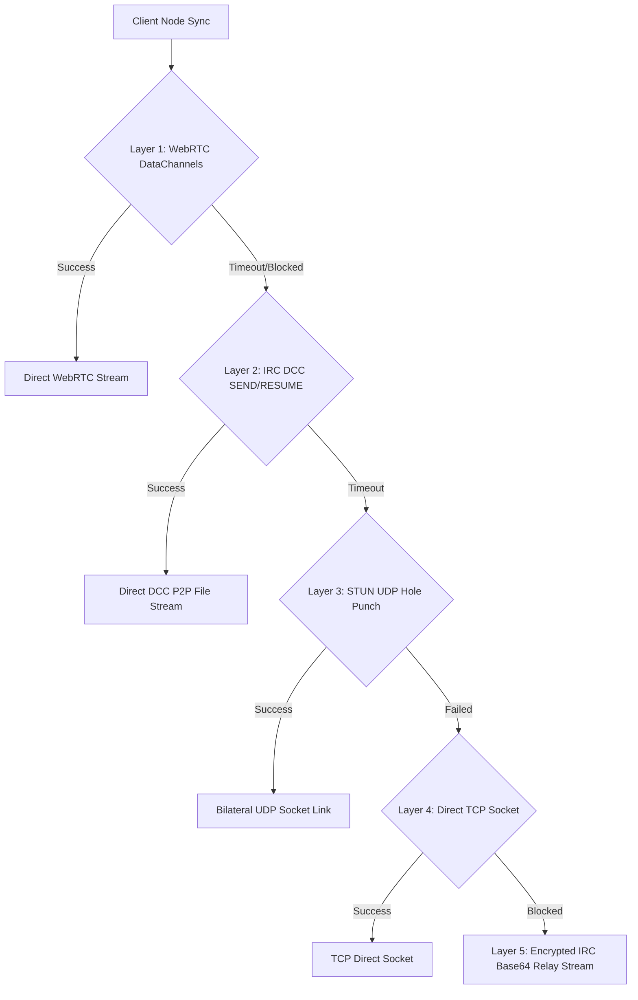

# 🏛️ PayQuant (PQN) Ecosystem Architecture Specifications

PayQuant (PQN) v6.0.0 is built on a modular 3-tier architecture comprising **Post-Quantum Cryptography**, **Enterprise RocksDB Storage**, and **Zero-Port-Forwarding Hybrid P2P Networking**.

---

## 🌐 1. Hybrid P2P Network Architecture

Nodes establish direct data stream links behind any router or firewall through a 5-layer transport fallback matrix:

### Transport Layer Cascade
1. **WebRTC DataChannels & ICE**: High-speed P2P streaming with SDP Offer/Answer signaling over public IRC channels and STUN candidate resolution (`stun.l.google.com:19302`).
2. **IRC DCC (Direct Client-to-Client)**: Native IRC `DCC SEND`, `DCC RESUME`, and `Reverse DCC` chat/transfer protocol.
3. **STUN UDP Hole Punching**: Bilateral UDP firewall pinhole punching.
4. **Direct TCP Socket**: Fallback connection for nodes with open public IP endpoints.
5. **Encrypted IRC Base64 Relay Stream**: 100% guaranteed fallback relaying Base64 payload chunks over active IRC connections (`PRIVMSG`).

---

## 💾 2. Enterprise RocksDB Storage Engine

- **Column Families**:
  - `blocks`: Stores block header metadata, merkle roots, nonces, and raw block JSON.
  - `utxo_set`: Dedicated unspent transaction output index for high-speed balance audits.
  - `snapshots`: Fast-sync UTXO snapshot state checkpoints.
- **Buffer & Performance Tuning**:
  - `write_buffer_size`: 64 MB
  - `block_size`: 4 KB
  - `cache_size`: 256 MB
  - `max_open_files`: 1000

---

## ⚡ 3. Fast-Sync UTXO Snapshot Protocol

- **Snapshot Generation**: Full nodes generate verified periodic UTXO snapshots every 100 blocks containing all unspent outputs and state hashes.
- **Fast Synchronization**: New nodes pull the latest snapshot over WebRTC DataChannels or IRC DCC, verify against the network block hash, and sync in minutes rather than hours!
